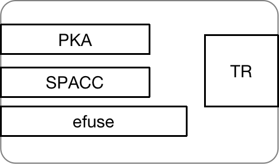

# PoCI 的证明模型

### 什么是PoCI
PoCI (Proof of Computation Integrity) 算力完整性证明，是我们创新性的区块链核心共识机制。不同于传统的工作量证明POW(Proof Of Work), 该共识机制摒弃了繁杂的大量计算，转而使用声称的芯片拥有权完成对芯片算力的证明。我们利用芯片里的安全引擎结构，通过私密签名完成了这一算力的完整证明，具体细节如下展开。

### 安全引擎
 \
如图所示，这是芯片的安全引擎示意图，一共由4个核心部分组成：efuse，PKA(public key accelerator)，SPAC(security protocol accelerator)和TRNG(true random number generator)。其中efuse是一块记录秘密私钥的烧写区域，这里讲的烧写指的是利用芯片驱动TRNG随机数发生，对efuse的电位进行修改的操作，由于高电位将低位0变为高位1，类似于"烧毁记录"，因此一次性不可逆的特性。这一组随机产生的数字则被永久记录在efuse，即为密钥SK。\
PKA和SPACC都为加解密算法加速器模块，分别可以做AES加解密和ECC对称加解密。这两个模块的具体实现如下阐述。

### 加密解密过程
值得注意的是efuse里的SK是芯片纳米级别的烧录，完全不可见。而且PKA模块的设计保证了SK的不泄漏，只允许通过其调度efuse区域用SK做加解密运算。\
通过芯片驱动再一次生成一个随机数，调用PKA模块进行ECC计算，得到一组新的非对称密钥对\{priK, pubK\}；此时调度SPACC，同时读取efuse的SK和priK，并用SK作为AES密钥加密私钥priK：

P2 = <i>AES</i>(SE, PriK)

其中P2是被SK加密的私钥PriK。可以想象这个世界上无人可以破解还原得到私钥PriK，除非再次利用这个芯片的SPACC读取efuse解密P2：

PriK = <i>AES</i>(SE, P2)

当然没有人有能力破解SK，因为这是一个128bit的随机数，难度可想而知。所以SPACC连同efuse形成了非常可靠的密钥存储机制。即便丢了PriK也没问题，只要有芯片再就可以得到PriK。事实上，为了安全，我们直接丢弃PriK，从此这个世界上无人再知晓。

### 签名+验签过程
但是虽然丢弃了PriK，我们仍然可以用芯片读出PriK，这样似乎依然不安全。所以这里安全引擎的设计进行了改进，SPACC不是直接"吐出"PriK，而是将PriK送去签名，"吐出"签名结果：

Sign = <i>S</i>(SE, <i>AES</i>(SE, P2), M)

其中<i>S</i>是PKA模块的签名函数。可以看到，P2被SPACC模块解密后直接送进PKA签名，最后得到Sign。根据ECC非对称加密原理，用pubK可以验证签名，还原得到原本的消息哈希值M。这个机制杜绝了作恶的机会。一个作恶者由于没有芯片，无法真正用芯片得到真实的Sign， 只能伪造，因此根本通不过pubK的验证。\
至此，我们完成了整个PoCI的共识过程。没有任何繁杂的PoW计算，只有芯片的烧录和签名过程就完成了对芯片拥有权的证明。权威的基金会通过严格测试，定义一颗芯片算力为<i>N</i> T，这样芯片持有者就可以打包他的信息上链，声称他有<i>N</i> T的计算能力：

\{P2, pubK\}

这些信息全部公开上链，接受全网的共识验证。只要任何M送进芯片，矿工都能得到对应的Sign以供全网验签，证明其算力合法性和PoCI。持有芯片的矿工同时提供地址Address和算力大小P2, 记录在Coffer数据区块中（详见Node章节）。

### 总结
PoCI充分利用了芯片巧妙的安全引擎设计，节省了PoW大量哈希计算的成本，高效安全地利用芯片烧录和签名证明了芯片算力，同时为芯片计算的真正应用打开新的大门，诸如高密度大规模计算和AI训练推理等。