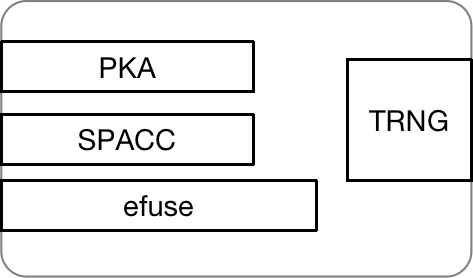

# PoCI 的证明模型

### 什么是POCI
POCI (Proof of Computation Integrity) 算力完整性证明，是我们创新性的区块链核心共识机制。不同于传统的工作量证明POW(Proof Of Work), 该共识机制摒弃了繁杂的大量计算，转而使用声称的芯片拥有权完成对芯片算力的证明。我们利用芯片里的安全引擎结构，通过私密签名完成了这一算力的完整证明，具体细节如下展开。

### 安全引擎
 \
如图所示，这是芯片的安全引擎示意图，一共由4个核心部分组成：efuse，PKA(public key accelerator)，SPAC(security protocol accelerator)和TR(true random number generator)。其中efuse是一块记录秘密私钥的烧写区域，这里讲的烧写指的是利用芯片驱动TR随机数发生，对efuse的电位进行修改的操作，由于高电位将低位0变为高位1，类似于"烧毁记录"，因此一次性不可逆的特性。这一组随机产生的数字则被永久记录在efuse，即为密钥SK。\
PKA和SPACC都为加解密算法加速器模块，分别可以做AES加解密和ECC对称加解密。这两个模块的具体实现如下阐述。

### 签名+验签过程
值得注意的是efuse里的SK是芯片纳米级别的烧录，完全不可见。而且PKA模块的设计保证了SK的不泄漏，只允许通过其调度efuse区域用SK做加解密运算。